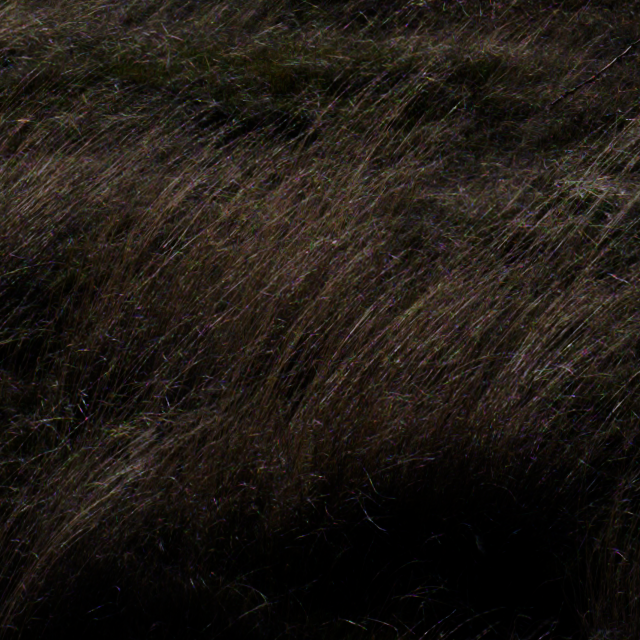
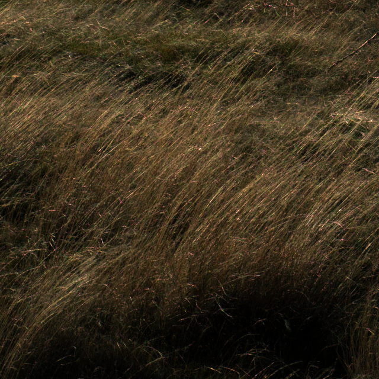
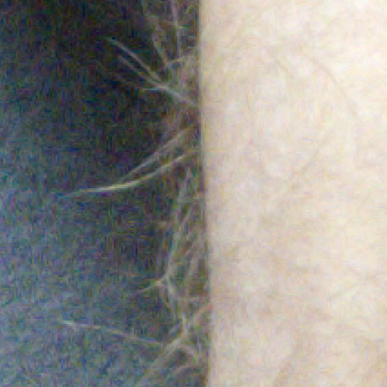
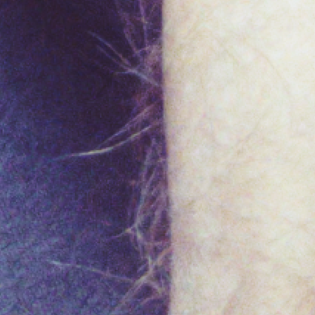

# cnn_demosaic

Demosaicing for X-Trans and Bayer sensors using convolutional neural networks (CNN).

## Introduction

The goal of this project is to improve image processing for Fuji cameras within open-source raw image processing software. Secondarily, the technique should be usable within bulk image processing pipelines, such as time-lapse, film digitization, and archival workflows.

Open source raw image processing software provide solutions which can be used by amateur and professional photographers, artists, and uses in other fields, they are extensible, configurable, and through open file formats and CLIs, can be used for bulk image processing and in processing pipelines. Dark Table and Raw Therapee are the two most users will be familiar with. Both of these tools provide non-destructive image editing. While these too tools provide trade-offs between different features and paradigms, they both fundamentally rely on the Markesteijn algorithm from the underlying dcraw tool. This algorithmic approach is fast (less than one second typically) and has been the best available for some time.

Commercial products have promised improved quality through the use of *AI*, and numerous papers show the promise of using ML techniques for demosaicing raw images at higher quality (I don't understand most of this work). This research and these products have not yet made their way to the open source community, at least not in a usable form. This project emerged from a personal research project to see if it was remotely possible to perform image demosaicing with entry-level ML knowledge and brute force. The answer is clear: *Yes, it absolutely is!* If you string enough CNNs together, and spend the requisite days training the model, they can produce output which exceeds, at least according to human perception, the best open source algorithmic approaches.

This approach will be slower than Markesteijn, by at least one order of magnitude, however, keep in mind that speed and quality can provide different trade-offs. In the current state, the model has been optimized for quality rather than speed, and for X-Trans sensors and not Bayer sensors. The initial research used a Bayer array pattern for training, and so training a Bayer-compatible model is entirely possible.

## Current Status

- [x] Output as 16-bit floating point OpenEXR images
- [ ] Output as 16-bit integer PNG images
- [ ] Proper color-space conversion from *camera RGB* to *sRGB*
- [ ] Include image metadata in output
- [ ] Train X-Trans models with noise-augmented images for combined ISO-optimized de-noise and demosaicing
- [ ] Train Bayer models

## Samples

I've provided two sample images processed in both RawTherapee using the Markesteijn with capture sharpening and false color suppression disabled. The CNN-Demosaic image is processed using the CLI and then adjusted and white balanced so that contrast and saturation are comparable to the RawTherapee image. Please note that the CLI still has issues producing accurate color output, which is visible to some degree in the output of these images.

### Example 1

Fuji X-E2 Sample Image

Markesteijn

CNN-Demosaic

[download](https://github.com/jjaeggli/cnn_demosaic/raw/refs/heads/main/assets/DSCF5657.exr) processed image  
[download](https://github.com/jjaeggli/cnn_demosaic/raw/refs/heads/main/assets/DSCF5657.raf) raw image

Credit: Jacob Jaeggli

From the examples above, it is clear there is a significant decrease in false color and linear artifacts in the CNN-Demosaic output versus Markesteijn. There is a more subtle increase in detail, and subjectively a more pleasing and natural appearance. 

### Example 2

Fuji X-T50 Sample Image

Markesteijn

CNN-Demosaic

<!-- [download] processed image  -->
[original](https://www.dpreview.com/sample-galleries/1737607092/fujifilm-x-t50-sample-gallery/8125134799)

<!-- [download](./assets/DSCF5657.exr) processed image
[download](./assets/DSCF5657.RAF) original -->
>>>>>>> Stashed changes

Credit: [Mitchell Clark](https://www.dpreview.com/about/staff/mitchell.clark), DP Review.

From the examples above, it is clear there is a significant decrease in false color and linear artifacts in the CNN-Demosaic output versus Markesteijn. There is a more subtle increase in detail, and subjectively a more pleasing and natural appearance.

## Installation

This installation uses Tensorflow and recommends a CUDA compatible GPU.

*Coming Soon!*
